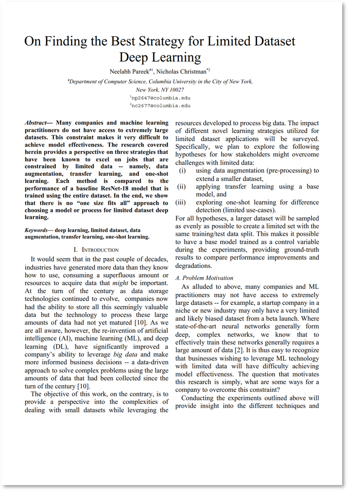

# On Finding the Best Strategy for Limited Dataset Deep Learning

## Introduction

The report that accompanies this work can be found in this repo: <!--[Final Report](On%20Finding%20the%20Best%20Strategy%20for%20Limited%20Dataset%20-%20Project%20Report%20-%20np2647_nc2677.pdf)-->

[](On%20Finding%20the%20Best%20Strategy%20for%20Limited%20Dataset%20-%20Project%20Report%20-%20np2647_nc2677.pdf)

Many companies and machine learning practitioners do not have access to extremely large datasets. This constraint makes it very difficult to achieve model effectiveness. The research covered herein provides a perspective on three strategies that have been known to excel on jobs that are constrained by limited data -- namely, data augmentation, transfer learning, and one-shot learning. Each method is trained using a small subset of the MNIST dataset and then compared to the performance of a baseline ResNet-18 model that is trained using the entire MNIST dataset. In the end, we show that there is no “one size fits all” approach to choosing a model or process for limited dataset deep learning.

***
### Objective
The goal of the experiments covered in this research is to provide a survey of different deep learning approaches that attempt or claim to address the issue of limited data.

***
### Environment
There would be no code if it weren't for the amazing infrastructure and frameworks. Below is a glance at the tools we leveraged to complete the objective defined above. At the time of these experiments, we relied on the following dependencies:
```
Python Version:      3.7.8
PyTorch Version:     1.7.1+cu101
Torchvision Version: 0.8.2+cu101
CUDA Version:        10.1
```
<table>
    <tr>
        <th></th>
        <th></th>
    </tr>
</table>


We ran all of our experiments on the Google Cloud Platform (GCP) infrastructure, leveraging the Google AI Platform as the Jupyter notebook server. For all experiments, we used the following baseline configuration:
```
Environment:    Python 3 (with Intel® MKL and CUDA 10.1)
Machine type:   n1-standard-8 (8 vCPUs, 30 GB RAM)
GPU:            NVIDIA Tesla V100 x 1
```
<table>
    <tr>
        <th></th>
        <th></th>
    </tr>
</table>

***
### Code Organization 
This repository is organized in the following way:

    /src
      |-- augmentation
      |     |-- augmentation.ipynd
      |     |-- output <<note: output is stored locally, but not tracked by git>>
      |
      |-- baseline
      |     |-- baseline.ipynd
      |     |-- output
      |
      |-- common <<see Note below>>
      |     |-- augmentation_utils.py
      |     |-- general_utils.py
      |     |-- oneshot_utils.py
      |     |-- torch_utils.py
      |
      |-- one-shot
      |     |-- oneshot.ipynd
      |     |-- output
      |
      |-- transfer-learning
      |     |-- transfer-learning.ipynd
      |     |-- output    
    
    /data <<note: data is downloaded and stored locally, it is not tracked by git>>
      |-- SubLoader 
      |     |-- processed <<note: train and test sets>>
      |     |-- raw <<note: raw data in IDX format>>
      |
      |-- Omniglot 
      |     |-- images_background <<note: training set>>
      |     |-- images_evaluation <<note: validation set>>
      |
      |-- OneShotMNIST 
            |-- processed
            |-- raw
    
    /resources
      |-- {resources for repo}
    
    {report.pdf}

Note: to leverage the "common" library of Python functions (in src/common), you must include the following:
``` python
# add local path to common/
sys.path.insert(0, '../common/')
# then add one or all of the following
from augmentation_utils import *
from general_utils import *
from oneshot_utils import *
from torch_utils import *
```   

***
### Running the Experiments
The majority of content is contained within each of the task specific Jupyter notebooks, as defined above. As such, one must upload the notebook to a functional Jupyter notebook server; moreover, to achieve optimal training time it might be desireable if the Jupyter notebook has access to GPUs. Each notebook provides in-line comments as well as some high level descriptions.

Each notebook is organized in a logical manner where all package imports occur first, followed by some administrative functions (version outputs, etc.), and then the core content is executed. As alluded to above, for any extensions or new development one must include the python packages located in the `common` directory. 
***
## References:
[1] Oh, Yujin, et al. “Deep Learning COVID-19 Features on CXR Using Limited Training Data Sets.” IEEE Transactions on Medical Imaging, vol. 39, no. 8, Aug. 2020, pp. 2688–700. DOI.org (Crossref), doi:10.1109/TMI.2020.2993291.   

[2] Peng, Xi, et al. “Learning Face Recognition from Limited Training Data Using Deep Neural Networks.” 2016 23rd International Conference on Pattern Recognition (ICPR), IEEE, 2016, pp. 1442–47. DOI.org (Crossref), doi:10.1109/ICPR.2016.7899840.   

[3] Transfer Learning for Computer Vision Tutorial — PyTorch Tutorials 1.7.1 Documentation. https://pytorch.org/tutorials/beginner/transfer_learning_tutorial.html. Accessed 04 Dec. 2020   

[4] Pan, Sinno Jialin, and Qiang Yang. “A Survey on Transfer Learning.” IEEE Transactions on Knowledge and Data Engineering, vol. 22, no. 10, Oct. 2010, pp. 1345–59. DOI.org (Crossref), doi:10.1109/TKDE.2009.191.  

[5] Li Fei-Fei, et al. “One-Shot Learning of Object Categories.” IEEE Transactions on Pattern Analysis and [5 Machine Intelligence, vol. 28, no. 4, Apr. 2006, pp. 594–611. DOI.org (Crossref), doi:10.1109/TPAMI.2006.79.    

[6] Lamba, Harshall. “One Shot Learning with Siamese Networks Using Keras.” Medium, 17 Feb. 2019, https://towardsdatascience.com/one-shot-learning-with-siamese-networks-using-keras-17f34e75bb3d.   

[7] Cheng, Ta-Ying. “Building a One-Shot Learning Network with PyTorch.” Medium, 31 May 2020, https://towardsdatascience.com/building-a-one-shot-learning-network-with-pytorch-d1c3a5fafa4a.    

[8] Holländer, Branislav. “Siamese Networks: Algorithm, Applications And PyTorch Implementation.” Medium, 24 Sept. 2018, https://becominghuman.ai/siamese-networks-algorithm-applications-and-pytorch-implementation-4ffa3304c18.   